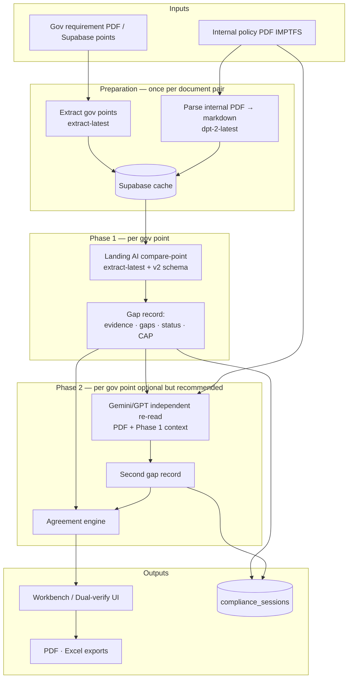

# Compliance Gap Analysis — System Architecture

**Audience:** Engineering, compliance architects, audit tooling owners  
**Scope:** CBUAE / TFS requirement mapping against internal policy (IMPTFS)  
**Principle:** Every regulatory obligation is evaluated **one point at a time** through structured **gap analysis**, not a single document-level summary.

---

## 1. Design intent

The platform does **not** produce one “overall compliance score” for a PDF pair. It produces **defensible, point-level gap records** suitable for regulatory audit trails:

| Output field | Purpose |
|--------------|---------|
| **Reference / Evidence** | Verbatim quote with Page + Section citation |
| **Fulfilled clauses** | Sub-conditions of the obligation that *are* covered |
| **Gap(s)** | Sub-conditions that are *missing* or only partially addressed |
| **Status** | Compliant · Partial Compliant · Non-Compliant |
| **Confidence %** | Quantified certainty tied to coverage depth |
| **Corrective Action Plan (CAP)** | Named operational fix per gap |
| **Responsibility** | Accountable function / department |

Phase 1 (Landing AI) performs the **primary gap analysis**. Phase 2 (Gemini/GPT) performs **independent verification** of Phase 1 — catching false positives, missed gaps, weak evidence, and incomplete CAPs before results are treated as final.

---

## 2. High-level architecture



---

## 3. Granularity modes

| Mode | Gov unit | Use when |
|------|----------|----------|
| **Section** | 2.1, 2.2, 2.3 … | Executive / chapter-level gap summary |
| **Leaf** | 2.1.1, 2.1.2 … | Full obligation-level audit (highest precision) |

Section mode rolls sub-bullets into one compare unit. Leaf mode evaluates each nested obligation separately. **Dual-verify should run at leaf granularity** when the goal is minimum incorrect findings.

---

## 4. Phase 1 CAP — how it is built

**CAP** = Corrective Action Plan. In Phase 1 it is the **`corrective_action_plan`** field from Landing AI, post-processed by the API before display.

### 4.1 Three layers (prompt → schema → code)

```
┌─────────────────────────────────────────────────────────────────┐
│ LAYER 1 — Prompt instruction (COMPARE_PROMPT_V2)                 │
│ Rule 5: GAP ANALYSIS for Partial / Non-Compliant only            │
│   • Split requirement into sub-conditions (and / bullets)        │
│   • fulfilled_clauses → bullets for what IS covered              │
│   • corrective_action_plan → "Gap(s):" + numbered missing items   │
│     + operational Fix per gap                                    │
│ Rule 6: CAP empty when Compliant; mandatory when Partial/Non     │
└────────────────────────────┬────────────────────────────────────┘
                             ▼
┌─────────────────────────────────────────────────────────────────┐
│ LAYER 2 — JSON schema (compliance-comparison-v2.schema.json)     │
│ Field: corrective_action_plan                                    │
│   "Start with Gap(s): then (1) Missing: … Fix: …"               │
│ Field: suggested_responsibility → department/role                │
└────────────────────────────┬────────────────────────────────────┘
                             ▼
┌─────────────────────────────────────────────────────────────────┐
│ LAYER 3 — API reconcile (landing-ai-client.service.ts)           │
│ • Reject generic CAP ("one or more sub-conditions", etc.)        │
│ • If Partial/Non and CAP missing → buildSpecificCorrectiveAction │
│ • Split gov text on "and ensure|establish|…" → numbered gaps     │
│ • Compliant → strip CAP and Responsibility (must be empty)       │
│ • Compliant + CAP text present → downgrade to Partial            │
│ • Status from model (semantic) — no keyword-token override       │
└────────────────────────────┬────────────────────────────────────┘
                             ▼
┌─────────────────────────────────────────────────────────────────┐
│ DISPLAY — formatComparisonMessage()                              │
│ Corrective Action Plan : [Gap(s): …] or N/A if Compliant        │
│ Responsibility : [role] or N/A                                   │
└─────────────────────────────────────────────────────────────────┘
```

### 4.2 CAP format (Phase 1 output)

**Compliant:**

```
Corrective Action Plan : N/A
Responsibility : N/A
```

**Partial / Non-Compliant (target format):**

```
Corrective Action Plan : Gap(s):
(1) Missing: [exact sub-condition from gov text not evidenced in IMPTFS]
(2) Missing: [next sub-condition]
Recommended action: Update internal policy to document and operationalize each missing control…

Responsibility : Compliance Team
```

The model is instructed to pair each **Missing** with a **Fix**. If the model returns vague CAP text, the API **replaces** it with numbered gaps derived from the requirement text (`buildSpecificCorrectiveAction`).

### 4.3 Phase 2 CAP

Phase 2 uses the same **display fields** (via `REFERENCE_MAP_PROMPT`) but is **not** schema-extracted — it is free-text from Gemini/GPT. Phase 2 CAP can challenge Phase 1: e.g. list gaps Phase 1 missed or downgrade status in the CAP / Output/Response fields.

---

## 5. Models, prompts, payloads, and output formats

### 5.1 Model map (every step)

| Step | Model | Landing AI / LLM endpoint | Env override |
|------|--------|---------------------------|--------------|
| Parse IMPTFS | **`dpt-2-latest`** | `POST https://api.va.landing.ai/v1/ade/parse` | `LANDING_AI_PARSE_MODEL` |
| Extract gov points | **`extract-latest`** | `POST …/v1/ade/extract` | `LANDING_AI_EXTRACT_MODEL` |
| **Phase 1 compare** | **`extract-latest`** | `POST …/v1/ade/extract` | `LANDING_AI_EXTRACT_MODEL` |
| **Phase 2 verify** | **`gemini-2.5-flash-lite`** (default) or user pick | `POST /ai/bcpanalyze` → Gemini API or Azure OpenAI | `GEMINI_API_KEY`, `GEMINI_DEFAULT_MODEL` |

Phase 2 model options (UI dropdown): `gemini-2.5-flash-lite`, `gemini-2.5-flash`, `gemini-3.5-flash`, `gemini-3.1-pro-preview`, `gpt-4o`, `gpt-4o-mini`, `gpt-3.5-turbo`, `gpt-5`.

**Phase 1** = Landing AI ADE Extract (markdown + JSON schema). **Not** Gemini/GPT chat.  
**Phase 2** = Gemini multimodal chat (PDF + prompt) or Azure GPT (text only, no PDF).

Prompt version Phase 1: **`v2`** (`LANDING_AI_COMPARE_PROMPT_VERSION=v2`). Legacy: `v1`.

---

### 5.2 Phase 1 — exact request to Landing AI

**BCP route:** `POST /landing-ai/compare-point`  
**Landing AI route:** `POST /v1/ade/extract`  
**Auth:** `Authorization: Bearer $VISION_AGENT_API_KEY`

**Multipart form sent to Landing AI:**

| Field | Value |
|-------|--------|
| `model` | `extract-latest` |
| `schema` | Contents of `apps/api/src/modules/landing-ai/schemas/compliance-comparison-v2.schema.json` |
| `markdown` | Single text blob = **Phase 1 prompt + IMPTFS markdown + gov point** (see §5.3) |

**BCP `compare-point` body (from browser):**

| Field | Example |
|-------|---------|
| `point` | `{"point_id":"2.1.1","title":"…","text":"LFIs should…"}` |
| `internalFileHash` | SHA-256 of IMPTFS PDF (loads parse cache) |
| `internalFileName` | `I M P T F S.pdf` |
| `forceCompare` | `"true"` to bypass Supabase compare cache |

IMPTFS **PDF binary is not sent** to Landing AI on compare — only **cached parse markdown** from Supabase is embedded in the `markdown` field.

---

### 5.3 Phase 1 — full prompt (`COMPARE_PROMPT_V2`)

**Source file:** `apps/api/src/modules/landing-ai/prompts/compliance-compare-prompts.ts`

Appended after this prompt block:

```
---
INPUT DATA:

ATTACHED INTERNAL PROCESS DOCUMENT ({internalFileName} — parsed markdown):

{full IMPTFS markdown from Supabase — entire document}

REQUIREMENT POINT TO CHECK:

{point_id} {title}
{gov obligation text — one point only}
```

**Full instruction prompt (sent as start of `markdown` field):**

```
You are an expert automated regulatory compliance auditor specializing in CBUAE and TFS frameworks. Your task is to evaluate the ENTIRE requirement point (full regulatory intent and all sub-obligations) against the attached Internal Process Document — using deep semantic and intent-based analysis, NOT keyword or surface-word matching.

NOTE FOR THIS SYSTEM: The Internal Process Document is provided below as full parsed markdown text (Landing AI ADE Parse output of the internal policy PDF). There is no separate PDF attachment — search the entire markdown section titled "ATTACHED INTERNAL PROCESS DOCUMENT".

CRITICAL EVALUATION LAWS:

1. WHOLE-POINT SEMANTIC COMPARISON (MANDATORY — NOT KEYWORD MATCHING):
   - Evaluate the COMPLETE requirement point as one regulatory obligation before assigning status.
   - Compare by MEANING, REGULATORY INTENT, and OPERATIONAL EFFECT — not by shared words or phrases.
   - Internal policy may use different terminology — treat as COVERED if the procedure achieves the same control outcome.
   - Map gov obligation → internal control: ask "Would an auditor conclude this internal procedure satisfies what the regulator intended?"
   - FORBIDDEN: Non-Compliant because gov wording absent; Compliant from keyword overlap without operational equivalence.

2. INTENT & EVIDENCE CONFIDENCE:
   - Confidence based on semantic completeness of intent coverage — not word overlap.
   - High 86–100 / Medium 31–85 / Low 0–30. 100% forbidden unless Compliant with every sub-intent evidenced.

3. EXACT SOURCE CITATION:
   - "uae_response_compliance_level": Page [X], Section [Y]: '[verbatim internal quote]'
   - Non-Compliant → exactly: "No corresponding procedure found."

4. COMPLIANCE STATUS MATRIX:
   - Compliant | Partial Compliant | Non-Compliant (after whole-point semantic review)

5. GAP ANALYSIS (Partial / Non-Compliant):
   - fulfilled_clauses: "• [sub-intent] — semantically satisfied by [procedure + section]"
   - corrective_action_plan: "Gap(s):" + numbered missing sub-intents + Fix

6. CORRECTIVE ACTION RULES: Empty CAP + responsibility when Compliant.

7. EVIDENCE FIELD ONLY: No status prefix in uae_response_compliance_level.

Output: one JSON object matching schema. No markdown fences. No conversational text.
```

*(Lines 20–85 in `compliance-compare-prompts.ts` contain the complete live prompt including JSON example block in the prompt.)*

---

### 5.4 Phase 1 — JSON schema & Landing AI raw output

**Schema file:** `apps/api/src/modules/landing-ai/schemas/compliance-comparison-v2.schema.json`  
**Schema key:** `compliance_comparison_v2`

**Required JSON fields Landing AI must return:**

| JSON field | Type | Maps to UI label |
|------------|------|------------------|
| `requirement_id` | string | Header (with point text) |
| `requirement_text` | string | Echo of gov obligation |
| `uae_response_compliance_level` | string | **Output/Response** |
| `comply_status` | enum | **Comply Yes/No (Status)** |
| `compliance_confidence_percentage` | integer | **Compliance Confidence %** |
| `fulfilled_clauses` | string | **Fulfilled clauses** |
| `corrective_action_plan` | string | **Corrective Action Plan** |
| `suggested_responsibility` | string | **Responsibility** |

**Example raw JSON from Landing AI ADE Extract:**

```json
[
  {
    "requirement_id": "2.1.1 Customer database screening",
    "requirement_text": "LFIs should search customer databases…",
    "uae_response_compliance_level": "Page 12, Section 7.1: 'UAE has undertaken regular and ongoing screening on the latest Sanctions Lists…'",
    "comply_status": "Partial Compliant",
    "compliance_confidence_percentage": 62,
    "fulfilled_clauses": "• Search customer databases — semantically satisfied by §7.1 screening process (Page 12)",
    "corrective_action_plan": "Gap(s): (1) Missing: screen before serious business relationship. Fix: Add explicit pre-transaction screening step in §7.1.",
    "suggested_responsibility": "Compliance Team"
  }
]
```

**After API normalize + `formatComparisonMessage()` → text shown in UI:**

```
2.1.1 Customer database screening
LFIs should search customer databases…

Reference PDF :
I M P T F S.pdf

Output/Response :
Page 12, Section 7.1: 'UAE has undertaken regular and ongoing screening…'

Fulfilled clauses :
• Search customer databases — semantically satisfied by §7.1 screening process (Page 12)

Comply Yes/No (Status) : Partial Compliant
Compliance Confidence % : 62%
Corrective Action Plan :
Gap(s): (1) Missing: screen before serious business relationship. Fix: …
Responsibility :
Compliance Team
```

**Phase 1 output type:** JSON from Landing AI → converted to **structured text** for cards/PDF/Excel. Not JSON in the UI.

---

### 5.5 Phase 2 — full prompt

**Source files:**
- `apps/web/src/lib/ai-lab/constants.ts` → `REFERENCE_MAP_PROMPT`
- `apps/web/src/lib/landing-ai/dual-verify-prompt.ts` → `buildDualVerifyPrompt()`

**BCP route:** `POST /ai/bcpanalyze`

| Form field | Content |
|------------|---------|
| `prompt` | Full text below (assembled at runtime) |
| `aiModel` | e.g. `gemini-2.5-flash-lite` |
| `file` | IMPTFS PDF binary (Gemini only) |

**Part A — `REFERENCE_MAP_PROMPT` (always first):**

```
You are an expert compliance reference mapper for CBUAE and TFS frameworks. Your task is to map each requirement point to exact evidence in the attached reference PDF file(s) and show what compliance is fulfilled.

CRITICAL RULES:
1. SEARCH ALL ATTACHED PDFs — evidence may be in any attached file.
2. REFERENCE PDF — exact filename where evidence found (e.g. "I M P T F S.pdf").
3. OUTPUT/RESPONSE — Page [X], Section [Y]: '[verbatim PDF quote]'. Non-Compliant → "No corresponding procedure found."
4. FULFILLED CLAUSES — bullet lines "• [requirement part] — covered by [PDF evidence]". Non-Compliant → "None".
5. COMPLIANCE STATUS — Compliant / Partial Compliant / Non-Compliant (strict gap analysis).
6. CONFIDENCE — 0–100%. 100% only when every sub-condition fully covered.

ABSOLUTE OUTPUT FORMAT (no JSON, no filler):

[Requirement number and title]
[Full requirement text]

Reference PDF :
[filename.pdf]

Output/Response :
[Page X, Section Y: 'verbatim quote']

Fulfilled clauses :
• [requirement part] — covered by [brief mapping to PDF evidence]

Comply Yes/No (Status) : [Compliant / Partial Compliant / Non-Compliant]
Compliance Confidence % : [0-100]%
Corrective Action Plan : [N/A if Compliant, else clear action]
Responsibility : [N/A if Compliant, else department]

---
INPUT DATA:

REQUIREMENT POINT TO CHECK:
```

**Part B — dual-verify addendum (appended by `buildDualVerifyPrompt`):**

```
DUAL VERIFICATION PIPELINE — PASS 2 (INDEPENDENT)
You are the second verifier. Landing AI (Pass 1) already analyzed this requirement. Re-read the attached internal PDF(s) yourself and produce your own assessment.

Rules:
1. Do NOT copy Pass 1 blindly — independently find evidence and assign status/confidence.
2. Use the same output format as Pass 1 (Reference PDF, Output/Response, Fulfilled clauses, Status, Confidence, CAP, Responsibility).
3. If you disagree with Pass 1, explain the difference in your Output/Response or CAP text.

LANDING AI PASS 1 (reference only):
---
{full Phase 1 message text from compare-point}
---

REQUIREMENT POINT TO CHECK:

{point_id} {title}
{gov obligation text}
```

**Phase 2 output type:** **Plain text only** (no JSON schema). Same field labels as Phase 1. Parsed by `parseReferenceComplianceBlock()` in the web app.

**GPT models:** cannot attach PDF — dual verify with evidence requires **Gemini**.

---

### 5.6 Side-by-side summary

| | Phase 1 | Phase 2 |
|---|---------|---------|
| **Model** | `extract-latest` | `gemini-2.5-flash-lite` (default) or user pick |
| **Service** | Landing AI ADE Extract | Gemini / Azure via `bcpanalyze` |
| **Prompt file** | `compliance-compare-prompts.ts` | `constants.ts` + `dual-verify-prompt.ts` |
| **Internal doc input** | Parsed **markdown** (full text in prompt) | **PDF file** attached |
| **Gov point** | In markdown blob | In prompt text |
| **Phase 1 result** | — | Embedded as reference block |
| **Output from model** | **JSON** (schema-enforced) | **Plain text** (fixed field labels) |
| **UI display** | JSON → formatted text | Text → parsed cards |
| **Cache** | Supabase compare cache | None (credits each run) |

---

## 6. End-to-end pipeline (correct flow)

### Stage A — Document preparation

```
Gov PDF ──► Extract live (Landing AI) ──► filter mandatory points ──► point list
     └──► OR Load from Supabase (seeded TFS guidelines, 0 credits)

Internal PDF ──► Parse to markdown (Landing AI) ──► Supabase parse cache
              └──► Required for Phase 1 compare (full markdown search)
```

Informational / intro gov points (definitions, purpose-only) are **skipped** — they are not compared.

### Stage B — Phase 1: Landing AI per-point gap analysis

**This is not “single compare.”** The browser (or batch job) calls `POST /landing-ai/compare-point` **once per selected gov point**.

For each point:

1. Inject **one** requirement (point_id + obligation text).
2. Search **full** internal policy markdown (parsed IMPTFS).
3. Apply **CBUAE/TFS auditor rules** (`compliance-compare-prompts.ts` v2).
4. Extract structured JSON via `compliance-comparison-v2.schema.json`.
5. Format as human-readable gap record (Reference PDF, Output/Response, Fulfilled clauses, Status, Confidence, CAP, Responsibility).

**Phase 1 gap logic (mandatory — semantic, not keyword):**

- Evaluate the **whole requirement point** by regulatory **intent** and operational equivalence — internal policy may use different words if the control outcome is the same.
- Split obligation into sub-intents; map each to internal procedures in `fulfilled_clauses` with semantic mapping (not word overlap).
- **Compliant** only if every sub-intent is operationally satisfied (wording may differ).
- **Partial Compliant** if some sub-intents met, others missing → CAP lists each gap by regulatory intent.
- **Non-Compliant** if no procedural equivalent exists.
- Confidence reflects **semantic completeness**, not keyword match count.
- API post-processing does **not** override model status using word-token matching — Landing AI semantic judgment is authoritative; code only fixes missing evidence and generic CAP fallbacks.

**Phase 1 alone** is available at `/landing-ai` (section or leaf). Results auto-save to Supabase after each point.

### Stage C — Phase 2: Independent verification (dual verify)

Available at `/landing-ai/dual-verify` (section or leaf).

For each point, **after** Phase 1 completes:

1. **Gemini/GPT** receives the attached IMPTFS PDF(s) + the gov point + Phase 1 output (reference only).
2. Model must **re-read the PDF independently** — not copy Pass 1.
3. Model produces the **same gap record format** (`REFERENCE_MAP_PROMPT` structure).
4. If Phase 2 disagrees, difference must appear in Output/Response or CAP.

**Phase 2 is a quality gate**, not a replacement for Phase 1. It answers: *“Is Phase 1’s gap analysis legally and evidentially correct?”*

### Stage D — Agreement check (automated)

`dual-verify-merge.ts` compares Phase 1 and Phase 2:

| Agreement status | Meaning | Action |
|------------------|---------|--------|
| **Aligned** | Same status; confidence delta ≤ 15 | Accept for reporting (subject to spot audit) |
| **Confidence gap** | Same status; confidence differs > 15 | Review evidence depth; reconcile confidence |
| **Both non-compliant** | Both flag gaps; different severity | Merge CAP lists; take stricter status |
| **Status mismatch** | Compliant vs Partial/Non (or opposite) | **Mandatory human review** — one pass is wrong |

### Stage E — Persistence & replay

| Store | Key | Contents |
|-------|-----|----------|
| `landing_ai_parse_cache` | internal file hash | Full IMPTFS markdown |
| `landing_ai_extract_cache` | gov file hash | Gov point list |
| `landing_ai_compare_cache` | internal hash + point_id | Phase 1 per-point result |
| `landing_ai_compliance_sessions` | session_key (hashes + granularity) | Full run: Phase 1 and/or dual-verify merged by point_id |

Granularity keys: `section` · `leaf` · `dual-section` · `dual-leaf`.

Reload saved sessions = **0 Landing AI / LLM credits**.

---

## 7. What Phase 2 prevents

Phase 1 uses structured extract over parsed markdown. It is fast and schema-bound but can still err. Phase 2 mitigates:

| Phase 1 failure mode | How Phase 2 catches it |
|----------------------|---------------------------|
| **False Compliant** — missed sub-condition | Independent PDF read finds uncovered obligation → status downgrade |
| **Wrong evidence quote** — paraphrase or wrong section | Second pass must cite Page/Section verbatim from PDF |
| **Incomplete gap list** — CAP says “review controls” without naming gaps | Phase 2 prompt requires strict gap bullets; disagreement surfaces in CAP |
| **Over-confidence** — 90% on Partial coverage | Confidence delta flag if Phase 2 scores lower |
| **Markdown parse blind spot** — table/image content weak in parse | PDF-native read (Gemini with file) may find evidence parse missed |
| **Section rollup error** — merged section hides leaf gap | Run **leaf dual-verify** for precision |
| **Stale cache** — old internal policy version | Re-parse internal PDF; force compare (`forceCompare=true`) |

Phase 2 **does not guarantee 0% error** — it reduces single-model risk to **detectable disagreement**. Final sign-off for mismatches remains **human auditor** responsibility.

---

## 8. Component map

| Layer | Path | Role |
|-------|------|------|
| Web workbench | `apps/web/.../compliance-workbench.tsx` | Phase 1 loop, exports, session save/load |
| Dual verify UI | `apps/web/.../dual-verify-workbench.tsx` | Phase 1 → Phase 2 → agreement |
| Phase 1 prompt | `apps/api/.../compliance-compare-prompts.ts` | Auditor laws + gap rules |
| Phase 1 schema | `compliance-comparison-v2.schema.json` | Structured extract fields |
| Phase 2 prompt | `apps/web/.../dual-verify-prompt.ts` | Independent verify + Pass 1 context |
| Agreement | `apps/web/.../dual-verify-merge.ts` | Status/confidence reconciliation |
| API compare | `landing-ai.service.ts` → `comparePoint()` | Parse cache + ADE extract |
| Sessions | `landing-ai-cache.service.ts` | Supabase merge by point_id |

---

## 9. API sequence (dual verify, one point)

```
Client                          API                           Landing AI / LLM
  │                              │                                    │
  │── POST /compare-point ──────►│── get parse cache ────────────────►│ ADE Extract (Phase 1)
  │◄── landingMessage ───────────│◄── gap JSON → formatted message ───│
  │                              │                                    │
  │── POST /ai/bcpanalyze ──────►│── Gemini/GPT + PDF + prompt ──────►│ Phase 2 gap record
  │◄── llmMessage ───────────────│◄──────────────────────────────────│
  │                              │                                    │
  │── compareDualVerifyResults ──│ (client-side agreement)            │
  │                              │                                    │
  │── POST /compliance-sessions ►│── merge results_json ─────────────►│ Supabase
```

---

## 10. Semantic matrix (parallel track)

Excel/CSV **semantic matrix compare** is a separate flow: it gap-analyses **two structured artifacts** (granular matrix vs executive checklist) via LLM — not per-point PDF compare. Use it for **document consistency audits**, not primary regulatory evidence mapping.

---

## 11. Related documents

| Document | Purpose |
|----------|---------|
| [COMPLIANCE_ANALYSIS_QUALITY_FRAMEWORK.md](./COMPLIANCE_ANALYSIS_QUALITY_FRAMEWORK.md) | Auditor workflow, sign-off gates, professional output standards |
| [DUAL_VERIFY_AND_ANALYSIS_WORKFLOW.md](./DUAL_VERIFY_AND_ANALYSIS_WORKFLOW.md) | Team lead box diagrams (short) |
| [doc.md](./doc.md) | API / ADE technical reference |

---

*Architecture version aligns with branch `feature/dual-verify-pipeline`.*
