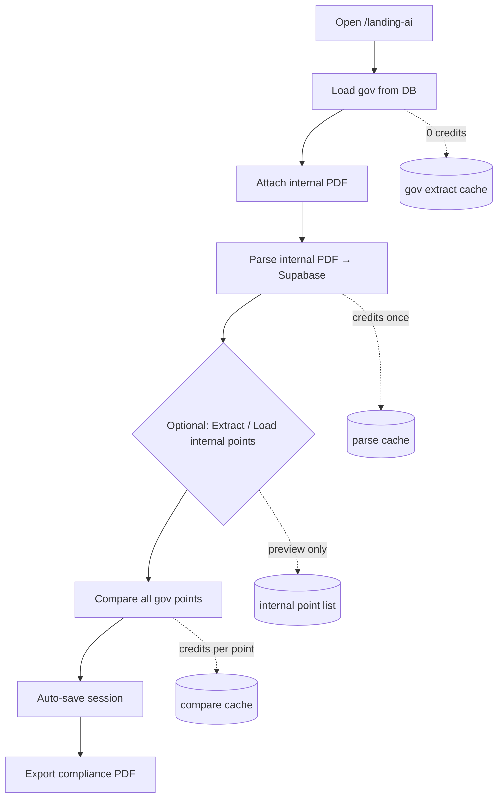
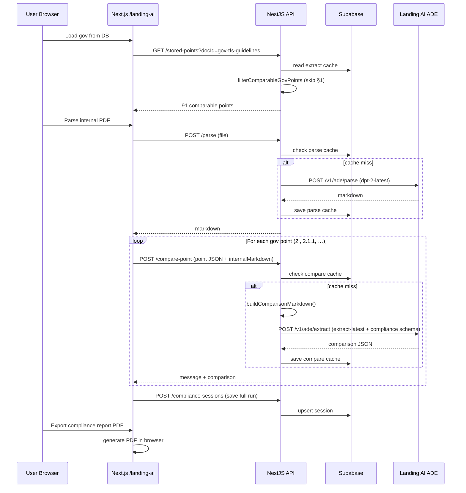

# Landing AI Compliance Workbench — How It Works

This document describes the end-to-end flow for comparing **government requirement PDFs** (e.g. TFS Guidelines) against **internal policy PDFs** (e.g. I M P T F S.pdf) using **Landing AI ADE only** (no Gemini/OpenAI for compare).

**UI:** `http://localhost:3000/landing-ai`  
**API:** `http://localhost:4000/landing-ai/*`

---

## TL;DR — How it runs in 30 seconds

1. **Load gov points from DB** (free) — 91 requirement bullets from TFS Guidelines, **§1 skipped**, starts at §2.
2. **Parse internal PDF once** (Landing AI Parse → Supabase) — full text markdown; **required for compare**.
3. **Compare loop** — browser calls `POST /compare-point` **once per gov point** (~91 times).
4. Each compare call = **Landing AI Extract** with:
   - **Model:** `extract-latest`
   - **“Prompt”:** markdown instructions we build + one gov point + **full internal PDF text**
   - **Schema:** `compliance-comparison.schema.json` → status, evidence quote, confidence
5. Results cached in Supabase → reload / export PDF for **0 credits** on repeat.

**We do not send a chat prompt to GPT/Gemini.** Compare uses Landing AI **ADE Extract** (markdown + JSON schema), not `/chat/completions`.

---

## Do we send a “prompt”?

| Step | Chat prompt? | What actually goes to the model |
|------|--------------|-----------------------------------|
| **Parse** | No | PDF file + model name only |
| **Extract gov/internal points** | No | Parsed markdown + JSON schema (field descriptions guide the model) |
| **Compare** | **Sort of** | Custom **instruction markdown** (built in code) + full internal markdown + JSON schema |

For compare, the closest thing to a prompt is `buildComparisonMarkdown()` in `landing-ai-client.service.ts`. It is **not** sent to a chat API — it is the `markdown` field on `POST /v1/ade/extract`, together with `compliance-comparison.schema.json`.

The JSON schema field **descriptions** also instruct the model (e.g. “Quote evidence verbatim”, “status: Compliant | Partial | Non-Compliant”).

---

## Master reference: operation → method → model → input

| User action | Web function | API route | Service method | Client method | Landing AI endpoint | Model | Input / “prompt” |
|-------------|--------------|-----------|----------------|---------------|---------------------|-------|------------------|
| Load gov from DB | `loadGovFromDb()` | `GET /stored-points` | `getStoredPoints()` | — | — | — | Supabase extract cache |
| Parse internal PDF | `parseInternalToDb()` | `POST /parse` | `parseFile()` | `parseDocument()` | `/v1/ade/parse` | `dpt-2-latest` | PDF binary |
| Extract gov | `extractGovPoints()` | `POST /extract-gov-points` | `extractPoints()` | `extractWithSchema()` | `/v1/ade/extract` | `extract-latest` | markdown + `gov-requirement-points.schema.json` |
| Extract internal | `extractInternalPoints()` | `POST /extract-internal-points` | `extractPoints()` | `extractWithSchema()` | `/v1/ade/extract` | `extract-latest` | markdown + `internal-policy-points.schema.json` |
| Compare 1 point | `analyzePoint()` | `POST /compare-point` | `comparePoint()` | `compareRequirement()` → `buildComparisonMarkdown()` + `extractWithSchema()` | `/v1/ade/extract` | `extract-latest` | instruction md + gov point + full internal md + `compliance-comparison.schema.json` |
| Compare all | `runComparison()` | *(loops compare-point)* | same | same | same × N | same | same per point |
| Export PDF | `exportReportPdf()` | — | — | — | — | — | Browser-only |
| Save session | *(after compare)* | `POST /compliance-sessions` | `saveComplianceSession()` | — | — | — | JSON results |

---

## 1. Architecture overview

```
┌─────────────────┐     HTTP (REST)        ┌─────────────────────┐
│  Next.js Web    │  ───────────────────►  │  NestJS API         │
│  apps/web       │                        │  apps/api           │
│  landing-ai/    │                        │  landing-ai module  │
└─────────────────┘                        └──────────┬──────────┘
                                                        │
              ┌─────────────────────────────────────────┼─────────────────────────┐
              ▼                                         ▼                         ▼
     Landing AI ADE                           Supabase PostgreSQL          Browser PDF export
  api.va.landing.ai/v1/ade              parse / extract / compare cache    (compliance report)
```

### Key principle

This is **not a chat application**. There is no conversational prompt to GPT/Gemini for compare.

Landing AI **ADE** (Agentic Document Extraction) exposes two HTTP APIs:

| ADE API | Input | Output |
|---------|-------|--------|
| **Parse** | PDF binary | Full document markdown |
| **Extract** | Markdown + JSON schema | Structured JSON fields |

**Compare** = Extract with a custom JSON schema + an instruction markdown block we build in code (this is the closest thing to a “prompt”).

---

## 2. Environment & models

Configure in `apps/api/.env`:

| Variable | Default | Purpose |
|----------|---------|---------|
| `VISION_AGENT_API_KEY` | *(required)* | Bearer token for Landing AI |
| `LANDING_AI_API_BASE` | `https://api.va.landing.ai` | API host |
| `LANDING_AI_PARSE_MODEL` | `dpt-2-latest` | PDF → markdown |
| `LANDING_AI_EXTRACT_MODEL` | `extract-latest` | Point lists + compare |
| `SUPABASE_URL` | *(required)* | Cache storage |
| `SUPABASE_SERVICE_KEY` | *(required)* | Server-side DB access |
| `PORT` | `4000` | API port |

---

## 3. Built-in documents

Hard-coded profiles in `apps/api/src/modules/landing-ai/builtin-docs.ts`:

| docId | File | SHA-256 (file_hash) | Schema |
|-------|------|---------------------|--------|
| `gov-tfs-guidelines` | TFS Guidelines.pdf | `c84713f9…` | `gov_requirement_points` |
| `internal-imptfs` | I M P T F S.pdf | `6a0a0bd1…` | `internal_policy_points` |

Seeded extract JSON lives in `apps/api/src/modules/landing-ai/seed-data/`.

---

## 4. User workflow (recommended order)



### What each UI button does

| UI button | Landing AI? | Credits | Used for |
|-----------|-------------|---------|----------|
| **Seed DB / Load gov from DB** | No (reads cache) | 0 | Gov requirement point list |
| **Parse internal PDF → Supabase** | Parse | Once per PDF | **Compare** (full markdown) |
| **Extract internal points** | Extract | Once | Preview list only |
| **Load internal points from DB** | No | 0 | Preview list only |
| **Compare all gov points** | Extract × N | 1 per point* | Gap analysis |
| **Load selected analysis** | No | 0 | Reload saved run |

\*Cache hit = 0 credits for that point.

### Critical distinction: Parse vs Extract

| Operation | Stores | Compare uses it? |
|-----------|--------|------------------|
| **Parse** | Full PDF text (markdown) | **Yes — required** |
| **Extract internal points** | Bullet list (~70 points) | **No — preview only** |

Compare sends the **entire parsed internal PDF markdown** on every gov point call, not the internal point list.

---

## 5. Gov point filtering (compare starts at §2)

Before compare, `filterComparableGovPoints()` in `gov-point-filter.ts` removes non-compliance points.

**Always skipped:**

- All **§1 and subpoints** (`1.`, `1.2.`, section starting with `1.`) — compare starts at **§2**
- Introduction, Purpose, Applicability, definitions without obligations
- Points tagged `point_type: informational`

**Result for TFS Guidelines seed:** ~91 comparable points starting at `2. SANCTIONS COMPLIANCE PROGRAM`.

Applied in:

- API: `GET /landing-ai/stored-points` → `comparablePoints`
- Web: when extracting gov points fresh

---

## 6. API endpoints reference

| Method | Route | Controller method | Service method |
|--------|-------|-------------------|----------------|
| GET | `/landing-ai/status` | `getStatus()` | `getStatus()` |
| GET | `/landing-ai/cache-status` | `getCacheStatus()` | `getCacheStatus()` |
| POST | `/landing-ai/parse` | `parse()` | `parseFile()` |
| POST | `/landing-ai/extract-gov-points` | `extractGov()` | `extractPoints(gov_requirement_points)` |
| POST | `/landing-ai/extract-internal-points` | `extractInternal()` | `extractPoints(internal_policy_points)` |
| GET | `/landing-ai/stored-points?docId=` | `getStoredPoints()` | `getStoredPoints()` |
| GET | `/landing-ai/stored-parse?docId=` | `getStoredParse()` | `getStoredParse()` |
| POST | `/landing-ai/compare-point` | `comparePoint()` | `comparePoint()` |
| POST | `/landing-ai/seed/builtin` | `seedBuiltin()` | `seedAllBuiltin()` |
| GET | `/landing-ai/compliance-sessions` | `listComplianceSessions()` | `listComplianceSessions()` |
| GET | `/landing-ai/compliance-sessions/:id` | `getComplianceSession()` | `getComplianceSession()` |
| POST | `/landing-ai/compliance-sessions` | `saveComplianceSession()` | `saveComplianceSession()` |
| GET | `/landing-ai/jobs` | `listJobs()` | `listJobs()` |

---

## 7. Operation details

### 7.1 Parse (PDF → markdown)

**UI:** Parse internal PDF → Supabase  
**Route:** `POST /landing-ai/parse` (multipart `file`)

**Call chain:**

```
LandingAiController.parse()
  → LandingAiService.parseFile(buffer, fileName)
    → cache.getParseCache(sha256(pdf))     // miss → call Landing AI
    → LandingAiClientService.parseDocument()
    → cache.saveParseCache()
```

**Landing AI HTTP request:**

```http
POST https://api.va.landing.ai/v1/ade/parse
Authorization: Bearer {VISION_AGENT_API_KEY}
Content-Type: multipart/form-data

  document: <PDF binary>
  model: dpt-2-latest
```

**No custom prompt.** Parse is native document understanding.

**Supabase table:** `landing_ai_parse_cache`  
**Key:** `file_hash` = SHA-256 of PDF bytes

---

### 7.2 Extract gov / internal points

**Gov route:** `POST /landing-ai/extract-gov-points`  
**Internal route:** `POST /landing-ai/extract-internal-points`

**Call chain:**

```
LandingAiService.extractPoints(buffer, fileName, schemaKey)
  → parseFile() if no markdown yet
  → cache.getExtractCache(fileHash, schemaKey)
  → LandingAiClientService.extractWithSchema(markdown, schemaKey)
  → cache.saveExtractCache()
```

**Landing AI HTTP request:**

```http
POST https://api.va.landing.ai/v1/ade/extract
Authorization: Bearer {VISION_AGENT_API_KEY}
Content-Type: multipart/form-data

  schema: <gov-requirement-points.schema.json | internal-policy-points.schema.json>
  markdown: <parsed document markdown>
  model: extract-latest
```

**Schemas:**

| schemaKey | File | Output |
|-----------|------|--------|
| `gov_requirement_points` | `schemas/gov-requirement-points.schema.json` | `{ points: [{ point_id, title, text, section, point_type }] }` |
| `internal_policy_points` | `schemas/internal-policy-points.schema.json` | Same shape for internal doc |

**Supabase table:** `landing_ai_extract_cache`  
**Key:** `(file_hash, schema_key)`

---

### 7.3 Compare (one gov point vs full internal markdown)

**UI:** Compare all gov points (browser loops)  
**Route:** `POST /landing-ai/compare-point` (multipart/form-data)

**FormData per request:**

```
point:              JSON { point_id, title, text, section? }
internalMarkdown:   <full parsed internal PDF markdown>
internalFileName:   "I M P T F S.pdf"
internalFileHash:   6a0a0bd13c7a32ea10c43c9a8391347a7e0caceaa0b17dd6443e9ee622111717
```

Optional: attach internal PDF files instead of `internalMarkdown` (API will parse them).

**Call chain:**

```
LandingAiController.comparePoint()
  → LandingAiService.comparePoint(point, files, fileName, markdown, internalFileHash)
    → resolveInternalMarkdown()           // PDF parse or markdown override
    → compareKey = sha256(internalFileHash + ":" + point_id)
    → cache.getCompareCache(compareKey)   // hit → return cached
    → LandingAiClientService.compareRequirement()
        → buildComparisonMarkdown()       // instruction block + gov point + full internal md
        → extractWithSchema(..., compliance_comparison)
    → cache.saveCompareCache()
    → formatComparisonMessage()           // JSON → UI card text
```

**There is no batch compare API.** ~91 gov points = up to 91 separate Extract calls.

---

## 8. Compare “prompt” — what we send to Landing AI

Compare does **not** call a chat completion API. It sends **markdown + JSON schema** to ADE Extract.

### Step 1: Instruction markdown (`buildComparisonMarkdown`)

Built in `LandingAiClientService.buildComparisonMarkdown()`:

```markdown
# COMPLIANCE COMPARISON TASK

You are comparing a government regulatory requirement against an internal policy document.
The internal document below is Landing AI ADE parse output — preserve page markers,
section headings, and verbatim wording when citing evidence.

## Rules
1. Search the ENTIRE internal policy markdown for evidence that satisfies the requirement.
2. output_response MUST use format: Page [X], Section [Y] [Title]: 'verbatim quote'
3. Use page numbers from parse markdown page markers (not guessed page numbers).
4. fulfilled_clauses: bullet lines starting with • for each sub-condition covered.
5. status: Compliant | Partial Compliant | Non-Compliant (strict gap analysis).
6. confidence: 0-100 integer aligned with status.

---

## GOVERNMENT REQUIREMENT POINT

Point ID: 2.1.1
Title: Review and approval of SCP
### Requirement text
Ensure that senior management has reviewed and approved the organization's SCP.

---

## INTERNAL POLICY DOCUMENT: I M P T F S.pdf

<entire parsed internal PDF markdown — can be 100KB+>
```

### Step 2: JSON schema (`compliance-comparison.schema.json`)

| Field | Description |
|-------|-------------|
| `reference_pdf` | Internal document filename |
| `output_response` | Page, section, verbatim quote (or "No corresponding procedure found.") |
| `fulfilled_clauses` | Bullet list of satisfied sub-requirements |
| `status` | `Compliant` \| `Partial Compliant` \| `Non-Compliant` |
| `confidence` | Integer 0–100 |
| `corrective_action` | Remediation plan or `N/A` |
| `responsibility` | Owner or `N/A` |

### Step 3: Landing AI Extract call

```http
POST https://api.va.landing.ai/v1/ade/extract
Authorization: Bearer {VISION_AGENT_API_KEY}
Content-Type: multipart/form-data

  schema: compliance-comparison.schema.json
  markdown: <combined instruction markdown from Step 1>
  model: extract-latest
```

### Step 4: Format for UI / PDF

`formatComparisonMessage()` converts JSON to card text:

```
2.1.1 Review and approval of SCP
Ensure that senior management...
Reference PDF :
I M P T F S.pdf
Output/Response :
Evidence location: Page X, Section Y: 'quote...'
Fulfilled clauses :
• ...
Comply Yes/No (Status) : Partial Compliant
Compliance Confidence % : 85%
Corrective Action Plan :
...
Responsibility :
...
```

---

## 9. Caching & Supabase tables

Migration: `docs/supabase/migrations/001_landing_ai_cache.sql`  
Sessions: `docs/supabase/migrations/002_compliance_sessions.sql` *(apply in Supabase SQL editor or `npm run db:migrate`)*

| Table | Stores | Key |
|-------|--------|-----|
| `landing_ai_parse_cache` | Full PDF markdown | `file_hash` (PDF SHA-256) |
| `landing_ai_extract_cache` | Gov points, internal points, **each compare result** | `(file_hash, schema_key)` |
| `landing_ai_jobs` | Audit log (operation, credits, duration) | auto UUID |
| `landing_ai_compliance_sessions` | Full saved compare run | `session_key` |

### Compare cache key

Per gov point, **not** per PDF alone:

```
compareKey = sha256( internalFileHash + ":" + point_id )
```

Stored as `landing_ai_extract_cache` row with `schema_key = compliance_comparison`.

---

## 10. Credit usage summary

| Action | Landing AI endpoint | Model | Typical credits |
|--------|---------------------|-------|-----------------|
| Parse PDF | `/v1/ade/parse` | `dpt-2-latest` | Once per PDF, then cached |
| Extract gov points | `/v1/ade/extract` | `extract-latest` | Once (seed → free from DB) |
| Extract internal points | `/v1/ade/extract` | `extract-latest` | Once (optional) |
| Compare 1 gov point | `/v1/ade/extract` | `extract-latest` | 1 per point |
| Any cache hit | — | — | **0** |
| Load from DB | — | — | **0** |

Restart API after changing `VISION_AGENT_API_KEY` in `.env`.

---

## 11. Saved analysis flow

After compare completes, the web app calls:

```
POST /landing-ai/compliance-sessions
  { govFileHash, internalFileHash, resultsJson, summaryJson, comparedPoints, ... }
```

List / reload:

```
GET /landing-ai/compliance-sessions          → dropdown list
GET /landing-ai/compliance-sessions/:id      → full results (0 credits)
GET /landing-ai/compliance-sessions/compare-cache  → rebuild from per-point cache
```

Requires migration **002** (`landing_ai_compliance_sessions` table).

---

## 12. Source code map

| Concern | Path |
|---------|------|
| Workbench UI | `apps/web/src/app/landing-ai/page.tsx` |
| API routes | `apps/api/src/modules/landing-ai/landing-ai.controller.ts` |
| Orchestration + cache | `apps/api/src/modules/landing-ai/services/landing-ai.service.ts` |
| Landing AI HTTP client | `apps/api/src/modules/landing-ai/services/landing-ai-client.service.ts` |
| Supabase cache | `apps/api/src/modules/landing-ai/services/landing-ai-cache.service.ts` |
| Gov point filter (§1 skip) | `apps/api/src/modules/landing-ai/utils/gov-point-filter.ts` |
| Web filter (synced) | `apps/web/src/lib/landing-ai/gov-point-filter.ts` |
| Extract schemas | `apps/api/src/modules/landing-ai/schemas/*.schema.json` |
| Seed data | `apps/api/src/modules/landing-ai/seed-data/` |
| DB migrations | `docs/supabase/migrations/` |
| Seed script | `apps/api/scripts/seed-landing-ai-cache.mjs` |

---

## 13. Sequence diagram (full compare run)



---

## 14. Troubleshooting

| Symptom | Likely cause | Fix |
|---------|--------------|-----|
| Empty “Saved analysis” list | Migration 002 not applied | Run `002_compliance_sessions.sql` in Supabase |
| Compare uses wrong evidence | Bad cached compare rows | Clear `compliance_comparison` rows in extract cache |
| Same quote for every point | Landing AI Extract on very long markdown | Clear cache, re-compare; spot-check cards before export |
| §1 still compared | Old API not restarted | Restart API, **Load gov from DB** again |
| Credits not updating | API not restarted after `.env` key change | Restart `npm run dev:api` |
| “Cannot reach API” | API down or wrong port | Run `npm run dev:api` (port 4000) |

---

## 15. Quick start commands

```bash
# Terminal 1 — API
npm run dev:api

# Terminal 2 — Web
npm run dev:web

# One-time: apply DB migrations (needs DATABASE_URL or SUPABASE_DB_PASSWORD)
npm run db:migrate

# One-time: seed gov + internal extract cache (no Landing AI credits)
npm run db:seed
```

Open: **http://localhost:3000/landing-ai**

---

## 16. One-page runtime flow (ASCII)

```
USER                    WEB (page.tsx)              API (NestJS)                 Landing AI              Supabase
  |                          |                          |                          |                      |
  |-- Load gov from DB ----->|                          |                          |                      |
  |                          |-- GET stored-points ---->|-- read extract cache --->|--------------------->|
  |                          |<- 91 comparable points --|<- filter skip §1 --------|<---------------------|
  |                          |                          |                          |                      |
  |-- Parse internal PDF --->|                          |                          |                      |
  |                          |-- POST /parse ---------->|-- cache miss? ---------->|                      |
  |                          |                          |-- POST /v1/ade/parse --->|  model: dpt-2-latest |
  |                          |                          |<- markdown --------------|                      |
  |                          |                          |-- save parse cache -------------------------------->|
  |                          |<- markdown --------------|                          |                      |
  |                          |                          |                          |                      |
  |-- Compare all ---------->|                          |                          |                      |
  |                          |  loop each gov point:    |                          |                      |
  |                          |-- POST /compare-point -->|                          |                      |
  |                          |   FormData:              |-- cache hit? ------------------------------------>|
  |                          |   point JSON             |   if miss:               |                      |
  |                          |   internalMarkdown       |-- buildComparisonMarkdown |                      |
  |                          |   internalFileHash       |-- POST /v1/ade/extract ->| model: extract-latest|
  |                          |                          |   schema: compliance_*   | md = instructions +  |
  |                          |                          |                          |   gov point + full   |
  |                          |                          |                          |   internal PDF text  |
  |                          |                          |<- comparison JSON -------|                      |
  |                          |                          |-- save compare cache ------------------------------>|
  |                          |<- message card ----------|                          |                      |
  |                          |  (repeat ~91 times)      |                          |                      |
  |                          |                          |                          |                      |
  |                          |-- POST compliance-sessions ------------------------->|--------------------->|
  |<- UI cards + export PDF -|                          |                          |                      |
```

### What gets sent on ONE compare call (example: point 2.1.1)

**HTTP:** `POST http://localhost:4000/landing-ai/compare-point`

**FormData (browser → API):**
```
point={"point_id":"2.1.1","title":"Review and approval of SCP","text":"Ensure that senior..."}
internalMarkdown=<100KB+ full I M P T F S.pdf parse output>
internalFileName=I M P T F S.pdf
internalFileHash=6a0a0bd13c7a32ea10c43c9a8391347a7e0caceaa0b17dd6443e9ee622111717
```

**Landing AI (API → api.va.landing.ai):**
```
POST /v1/ade/extract
  model=extract-latest
  schema=compliance-comparison.schema.json
  markdown=# COMPLIANCE COMPARISON TASK
           ...rules...
           ## GOVERNMENT REQUIREMENT POINT
           Point ID: 2.1.1
           ...
           ## INTERNAL POLICY DOCUMENT: I M P T F S.pdf
           <full document>
```

**Response (Landing AI → API → browser):**
```json
{
  "success": true,
  "cached": false,
  "pointId": "2.1.1",
  "message": "2.1.1 Review and approval of SCP\nEnsure that...\nReference PDF :\n...",
  "comparison": {
    "output_response": "Evidence location: Page 14, Section ...",
    "status": "Partial Compliant",
    "confidence": 85,
    "fulfilled_clauses": "• ...",
    "corrective_action": "N/A",
    "responsibility": "N/A"
  },
  "creditUsage": 1
}
```
